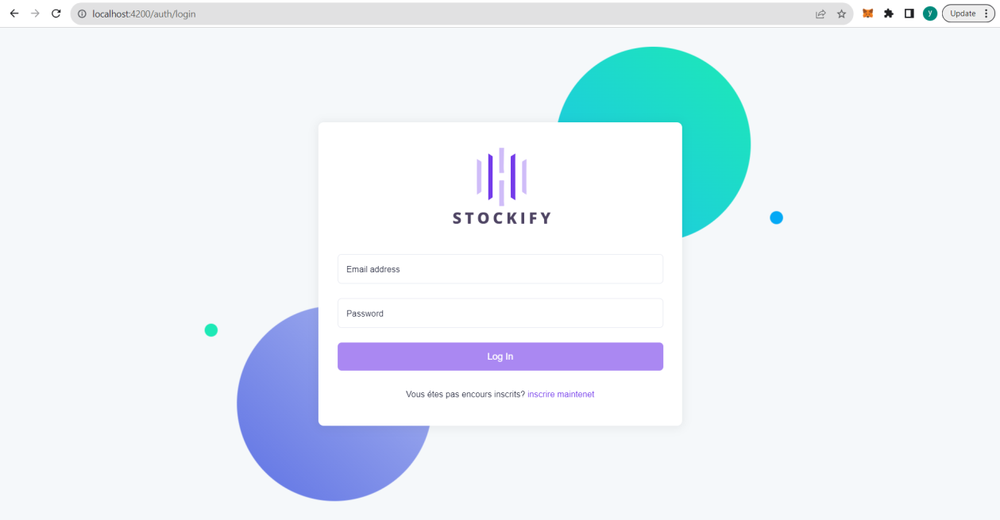
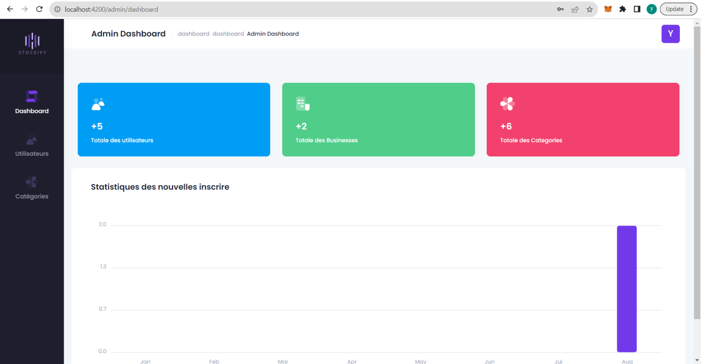
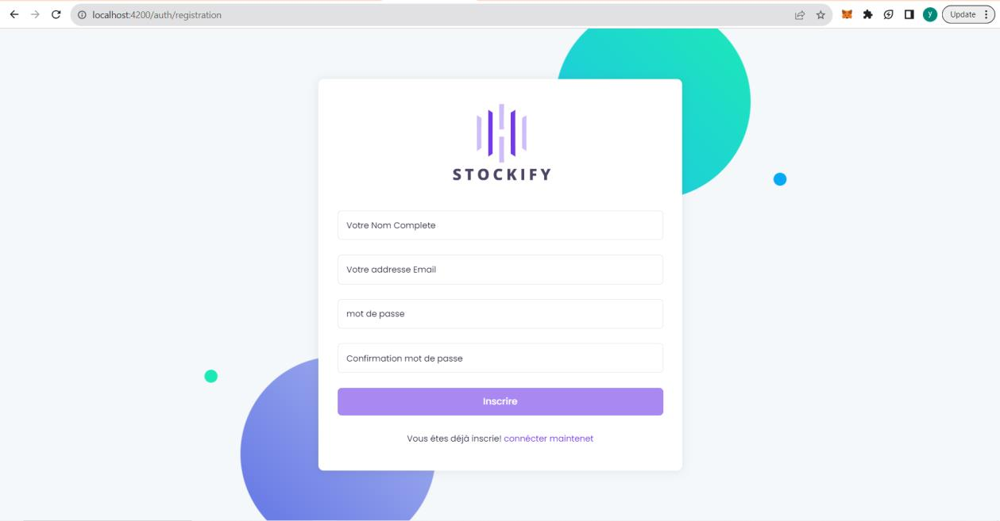
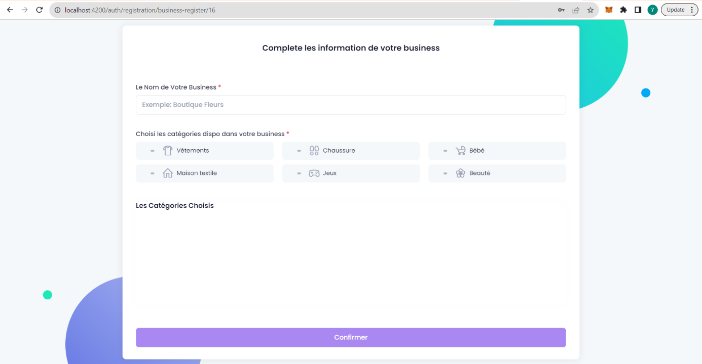
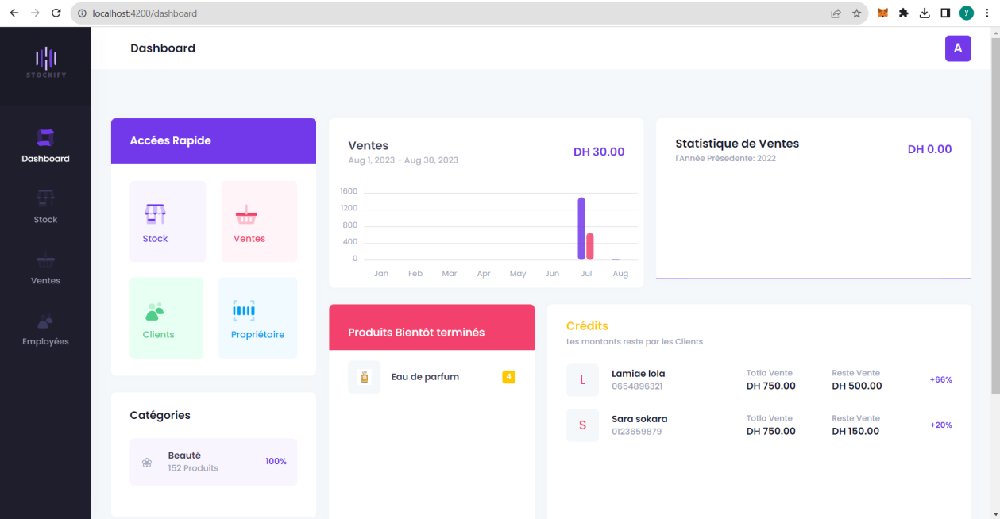
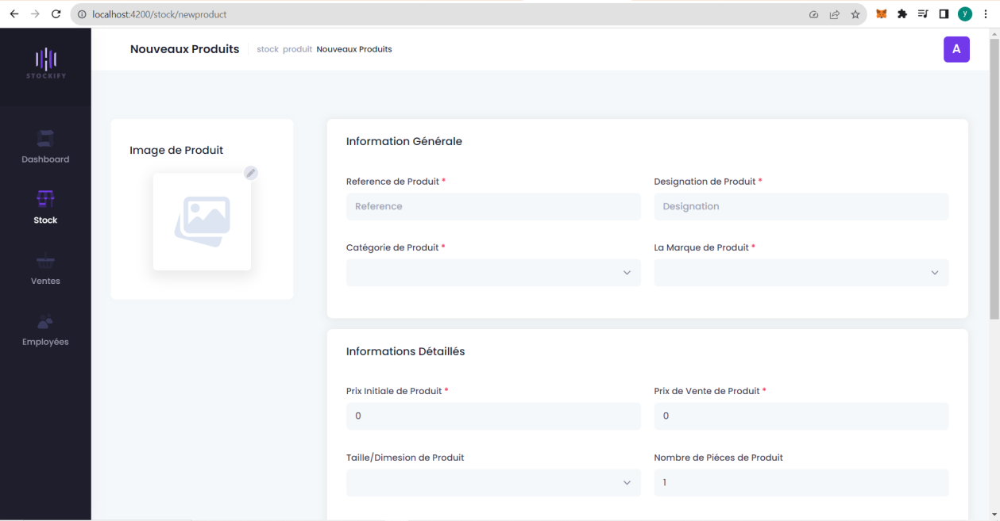
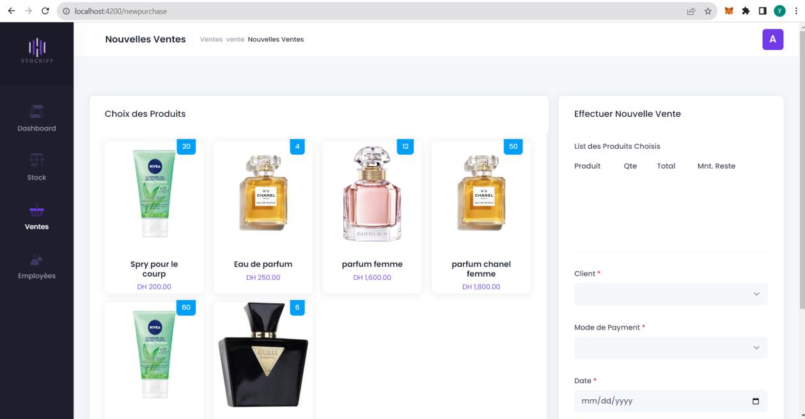

# Stockify — Plateforme de gestion de stock

> Projet de fin d'études — **Plateforme de gestion de stock pour boutiques individuelles**  

## 📌 Présentation

**Stockify** est une application web de gestion de stock et des ventes destinée aux boutiques individuelles. Le projet répond au besoin d'une solution centralisée, intuitive et accessible permettant de gérer les produits, les stocks, les clients et les ventes depuis un même espace.

La réalisation présentée dans le rapport met l'accent sur une **interface conviviale**, le suivi des stocks et des ventes, ainsi que la traçabilité des opérations.

## 🎯 Objectifs

La plateforme vise notamment à :

- simplifier la gestion quotidienne des produits et du stock ;
- permettre le suivi des ventes et des clients ;
- fournir des tableaux de bord avec des statistiques ;
- faciliter l'ajout et la gestion des produits ;
- signaler les produits dont le stock est faible ;
- améliorer la traçabilité des ventes ;
- permettre le téléchargement des détails d'une vente au format PDF ;
- proposer une solution SaaS accessible depuis différents dispositifs disposant d'une connexion Internet.

## 🛠️ Environnement technique

Le projet est réalisé avec une architecture **Frontend / Backend** :

| Composant | Technologie |
|---|---|
| Frontend | Angular 13 |
| Backend | Spring Boot 2.7.9 |
| Langages | Java, TypeScript |
| Base de données | MySQL |
| Versionnement | Git |
| IDE / Éditeur | Visual Studio Code |

L'API de Stockify est développée avec **Spring Boot** et expose l'accès aux données au moyen de requêtes HTTP.

## 🖥️ Interfaces principales

### 🔐 Authentification

L'accès à l'espace utilisateur commence par une authentification à l'aide d'une adresse e-mail et d'un mot de passe valides.

*Figure — Page de Login*

### 📊 Dashboard Administrateur

Après authentification, l'administrateur dispose d'un tableau de bord permettant de consulter les statistiques relatives aux utilisateurs, aux entreprises (*Business*) et aux catégories.

*Figure — Admin Dashboard*

### 📝 Inscription

Un nouvel utilisateur peut créer son espace de travail et définir son *Business* ainsi que les catégories associées.

**Étape 1 — Informations utilisateur**

**Étape 2 — Informations du Business et catégories**

### 📈 Dashboard Gérant

Le dashboard destiné aux gérants présente notamment :

- les statistiques des ventes des huit derniers mois ;
- les produits proches de la rupture de stock ;
- les informations relatives aux clients ayant des paiements insuffisants ;
- des accès rapides aux principales fonctionnalités de la boutique.

*Figure — Dashboard Gérant*

### ➕ Ajout d'un produit

Les responsables des boutiques peuvent ajouter facilement leurs produits dans leur espace de travail.

L'interface permet notamment de renseigner la référence, la désignation, la catégorie, la marque, les prix, la taille/dimension et le nombre de pièces.

*Figure — Ajouter un produit*

### 🛒 Réalisation d'une vente

L'interface de vente permet de sélectionner les produits, d'associer la vente à un client et de renseigner les informations de paiement.

La solution fournit également une fonction de **traçabilité** et permet de télécharger les détails d'une vente au **format PDF**.

*Figure — Vente des produits*

## 🧩 Résumé de la réalisation

La phase de réalisation a abouti à une plateforme web de gestion de stock orientée vers la simplicité d'utilisation. Le système permet aux gestionnaires de réaliser des ventes, de visualiser clairement les produits vendus et de conserver une trace des opérations.

L'interface graphique constitue un élément central de la solution : les différents espaces — authentification, administration, inscription, dashboard gérant, gestion des produits et ventes — sont organisés afin de faciliter les opérations quotidiennes.

## 🚀 Perspectives d'évolution

Le rapport identifie plusieurs pistes d'amélioration :

- mettre en place des **mécanismes d'alerte avancés** pour les produits à faible stock ;
- enrichir les fonctionnalités de **reporting et d'analyse** ;
- fournir une vue plus détaillée des tendances de stock, des mouvements et des coûts ;
- ajouter des fonctionnalités de **commerce électronique** ;
- proposer davantage de **personnalisation** afin d'adapter la plateforme aux besoins futurs des utilisateurs.

